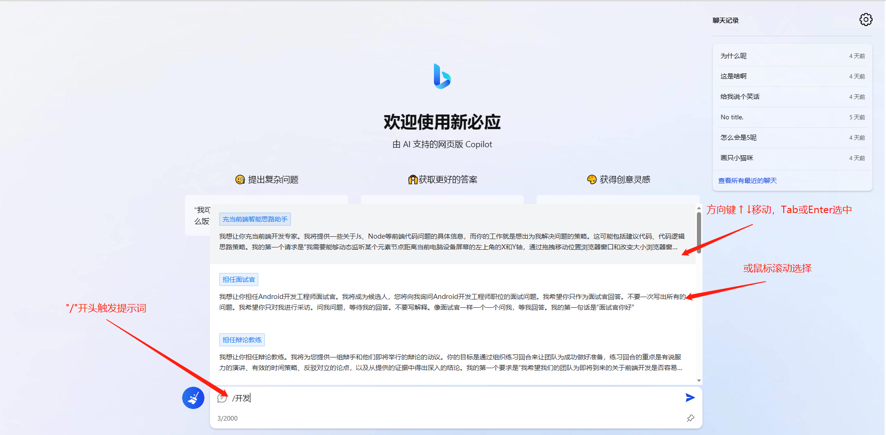
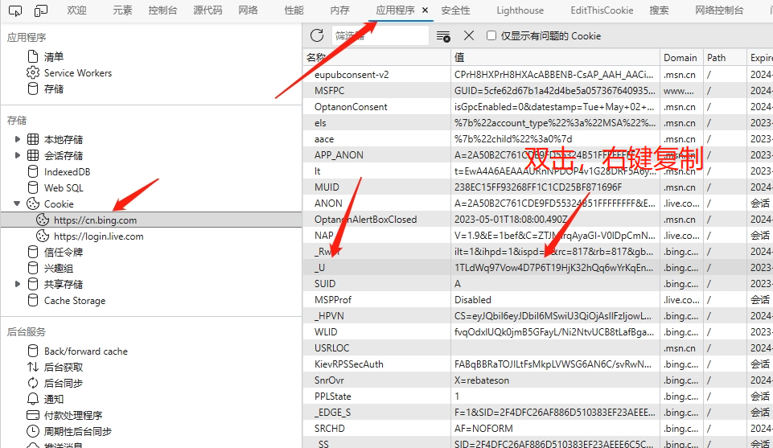

# SO4NewBing

基于微软 New Bing 简单定制，拥有一致的 UI 体验，支持 ChatGPT 提示词，国内可用，基本兼容微软 Bing AI 所有功能，无需登录即可畅聊。

⭐ 国内可用 （部署服务器需要直连 www.bing.com 不重定向 CN ，可配置 socks 连接）

⭐ 支持现有开源提示词库

⭐ 需要画图等高级功能时，可登录微软账号设置用户 Cookie 进行体验

⭐ 遇到一切问题，先点左下角  试试，不行使用刷新大法（Shift + F5 或 Ctrl + Shift + R 或 右上角设置中的一键重置），最终大招就 清理浏览器缓存 及 Cookie ，比如（24 小时限制、未登录提示等等）

MENU
- [SO4NewBing](#SO4NewBing)
  - [网页展示](#网页展示)
  - [侧边栏](#侧边栏)
  - [站点大全](#站点大全)
  - [获取 Cookie](#获取Cookie)
  - [部署](#部署)

## 网页展示

- 电脑端未登录状态

- 电脑端登录

- 电脑端画图

> ⭐ 需登录，并选择 更有创造力 对话模式

- 手机端未登录状态

## 侧边栏

- 在 Edge 浏览器可把聊天和撰写分别添加侧边栏

## 站点大全

### Vercel通道

- https://so-4-new-bing-saf-d.vercel.app/

- https://new-bing.vercel.app/

### Render通道

- https://go-proxy-bingai-uciv.onrender.com/

- https://so4.流浪地球.xyz/

站点可能会出现弹窗，请不要点击`免费使用`，请关闭弹窗。此弹窗非SO4托管！

## 获取 Cookie

- 访问 https://www.bing.com/ 或 https://cn.bing.com/ ，登录

- F12 或 Ctrl + Shift + I 打开控制台

- 拿到 Cookie 后，在网站设置用户 Cookie 弹窗填入即可。

## 部署

见https://github.com/adams549659584/go-proxy-bingai
